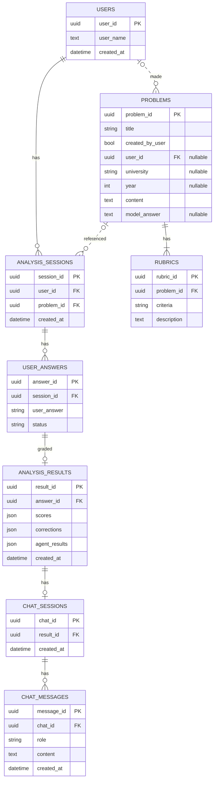

```mermaid
erDiagram
    USERS ||--o{ ANALYSIS_SESSIONS : has
    USERS |o..o{ PROBLEMS : made
    PROBLEMS ||--|{ RUBRICS : has
    ANALYSIS_SESSIONS ||--o{ USER_ANSWERS : has
    USER_ANSWERS ||--o| ANALYSIS_RESULTS : graded
    PROBLEMS |o..o{ ANALYSIS_SESSIONS : referenced
    ANALYSIS_RESULTS ||--o| CHAT_SESSIONS : has
    CHAT_SESSIONS ||--o{ CHAT_MESSAGES : has

    USERS {
        uuid user_id PK
        text user_name
        datetime created_at
    }

    PROBLEMS {
        uuid problem_id PK
        string title
        bool created_by_user
        uuid user_id FK "nullable"
        string university "nullable"
        int year "nullable"
        text content
        text model_answer "nullable"
    }

    RUBRICS {
        uuid rubric_id PK
        uuid problem_id FK
        string criteria
        text description
    }

    ANALYSIS_SESSIONS {
        uuid session_id PK
        uuid user_id FK
        uuid problem_id FK
        datetime created_at
    }

    USER_ANSWERS {
        uuid answer_id PK
        uuid session_id FK
        string user_answer
        string status
    }

    ANALYSIS_RESULTS {
        uuid result_id PK
        uuid answer_id FK
        json scores
        json corrections
        json agent_results
        datetime created_at
    }

    CHAT_SESSIONS {
        uuid chat_id PK
        uuid result_id FK
        datetime created_at
    }

    CHAT_MESSAGES {
        uuid message_id PK
        uuid chat_id FK
        string role
        text content
        datetime created_at
    }
```
