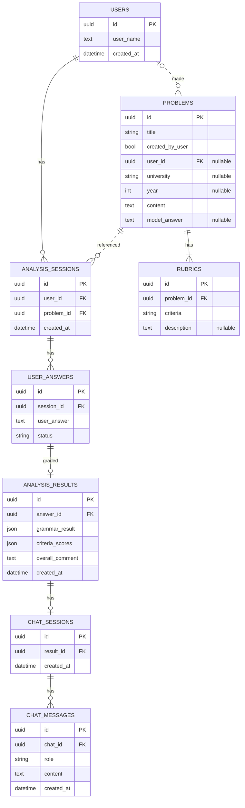

```mermaid
erDiagram
    USERS ||--o{ ANALYSIS_SESSIONS : has
    USERS |o..o{ PROBLEMS : made
    PROBLEMS ||--|{ RUBRICS : has
    ANALYSIS_SESSIONS ||--o{ USER_ANSWERS : has
    USER_ANSWERS ||--o| ANALYSIS_RESULTS : graded
    PROBLEMS ||..o{ ANALYSIS_SESSIONS : referenced
    ANALYSIS_RESULTS ||--o| CHAT_SESSIONS : has
    CHAT_SESSIONS ||--o{ CHAT_MESSAGES : has

    USERS {
        uuid id PK
        text user_name
        datetime created_at
    }

    PROBLEMS {
        uuid id PK
        string title
        bool created_by_user
        uuid user_id FK "nullable"
        string university "nullable"
        int year "nullable"
        text content
        text model_answer "nullable"
    }

    RUBRICS {
        uuid id PK
        uuid problem_id FK
        string criteria
        text description "nullable"
    }

    ANALYSIS_SESSIONS {
        uuid id PK
        uuid user_id FK
        uuid problem_id FK
        datetime created_at
    }

    USER_ANSWERS {
        uuid id PK
        uuid session_id FK
        text user_answer
        string status
    }

    ANALYSIS_RESULTS {
        uuid id PK
        uuid answer_id FK
        json grammar_result
        json criteria_scores
        text overall_comment
        datetime created_at
    }

    CHAT_SESSIONS {
        uuid id PK
        uuid result_id FK
        datetime created_at
    }

    CHAT_MESSAGES {
        uuid id PK
        uuid chat_id FK
        string role
        text content
        datetime created_at
    }
```
