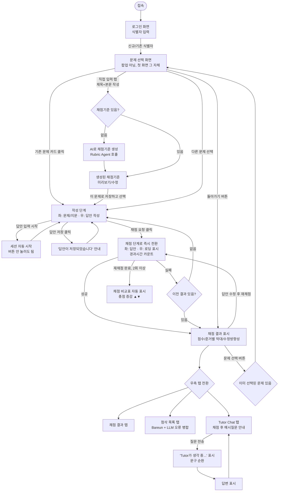

# Paragraphy UI 와이어프레임 및 사용 흐름

> 실제 구현된 프론트엔드(`frontend/index.html`, `frontend/app.js`) 기준으로 작성된 문서입니다.
> 화면은 팝업/모달 없이, 상태에 따라 동일한 컴포넌트(문제 박스·답안 박스·결과 패널)가
> 좌/우 컬럼 사이를 오가는 2단계 작업 화면 구조입니다.

---

## 1. 전체 사용 흐름도



---

## 2. 화면별 와이어프레임

### 2-1. 로그인 화면 (오버레이)

```
┌──────────────────────────────────────────┐
│                                            │
│        ┌──────────────────────┐           │
│        │  P  Paragraphy       │           │
│        │                      │           │
│        │  식별자(이름/별명)를  │           │
│        │  입력하세요.          │           │
│        │  ┌──────────────────┐│           │
│        │  │ 예: 유진          ││           │
│        │  └──────────────────┘│           │
│        │  ┌──────────────────┐│           │
│        │  │     시작하기      ││           │
│        │  └──────────────────┘│           │
│        └──────────────────────┘           │
│         (배경은 어둡게 처리된 페이지)        │
└──────────────────────────────────────────┘
```
- 처음 접속하거나 "전환" 버튼을 누르면 표시됨
- `localStorage`에 저장된 식별자가 있으면 자동으로 건너뜀

---

### 2-2. 문제 선택 화면 (팝업 아님 — 접속 직후 첫 화면)

```
┌──────────────────────────────────────────────────────────┐
│ P Paragraphy                     대입 논술 채점·첨삭  유진 전환│
├──────────────────────────────────────────────────────────┤
│ [문제 선택 버튼 없음]        선택된 문제가 없습니다.          │
├──────────────────────────────────────────────────────────┤
│ 문제 선택                                                   │
│ 기존 문제를 고르거나, 직접 문제와 채점기준을 입력할 수 있습니다 │
│ ┌───────────────────┬───────────────────┐                 │
│ │ 기존 문제에서 선택  │     직접 입력       │  <- 모드 탭     │
│ └───────────────────┴───────────────────┘                 │
│                                        [문제 새로고침]       │
│ ┌────────────────────────────────────────────────────────┐│
│ │ 국립국어원 논증적 글쓰기 — 로봇세 도입                     ││
│ │ 국립국어원 · 논증적 글쓰기 · 2025                         ││
│ ├────────────────────────────────────────────────────────┤│
│ │ 경희대 사회계 논술 2026 / 2025, 한양대 상경 논술 2026/2025 ││
│ └────────────────────────────────────────────────────────┘│
└──────────────────────────────────────────────────────────┘
```

**"직접 입력" 탭:**
```
문제 제목        [___________________________]
문제 본문/제시문  [___________________________]
                 [___________________________]
채점 기준(선택)                    [AI로 채점기준 생성]
                 [___________________________]  <- AI 생성 결과 미리보기/수정 가능
                 [    이 문제로 저장하고 선택    ]
```

---

### 2-3. 작성 단계 (문제 선택 직후)

```
┌──────────────────────────────────────────────────────────┐
│ P Paragraphy                     대입 논술 채점·첨삭  유진 전환│
├──────────────────────────────────────────────────────────┤
│ [문제 선택]  한양대 상경 논술 2025 — 한양대·상경계열·2025    │
│              세션이 아직 시작되지 않았습니다.    [세션 시작] │
├─────────────────────────────┬──────────────────────────────┤
│ 문제 (좌 컬럼)          [접기]│ 답안 작성 (우 컬럼)      0자  │
│                              │ ┌──────────────────────────┐ │
│ [가]~[라] 제시문 전문         │ │                          │ │
│                              │ │  (답안 입력 textarea,      │ │
│ 채점 기준 / 출제 문항         │ │   입력 시작하면 세션 자동   │ │
│ (해당 문제의 공식 채점기준)    │ │   생성됨)                 │ │
│                              │ └──────────────────────────┘ │
│                              │        [답안이 저장되었습니다]│
│                              │        [답안 저장] [채점 요청]│
└─────────────────────────────┴──────────────────────────────┘
```
- 답안을 타이핑하기 시작하는 순간 "세션 시작" 버튼 없이 세션이 자동 생성됨
- "답안 저장" 클릭 시 버튼 옆에 저장 완료 안내가 2.5초간 표시됨
- "채점 요청"은 내부적으로 답안 저장을 먼저 수행한 뒤 채점을 요청함

---

### 2-4. 채점 중 (로딩)

"채점 요청" 클릭 즉시 좌/우가 전환되고, 우측에 로딩이 표시됩니다.

```
┌─────────────────────────────┬──────────────────────────────┐
│ 답안 작성 (좌 컬럼)     24자  │ 채점 결과 | 첨삭 목록 | Tutor  │
│ ┌──────────────────────────┐│                               │
│ │ (작성한 답안, 계속 보임)   ││          ◐  (스피너)          │
│ └──────────────────────────┘│        채점 중입니다...        │
│        [답안 저장][채점 중...]│  경과 시간 12초 · 보통 20~60초 │
└─────────────────────────────┴──────────────────────────────┘
```
- 채점이 실패하면: 이전에 채점 결과가 있었으면 그 결과로 복귀, 처음 채점이면 작성 단계로 복귀

---

### 2-5. 채점 완료 (결과 탭)

```
┌─────────────────────────────┬──────────────────────────────┐
│ 답안 작성 (좌 컬럼)          │ [채점 결과] 첨삭 목록  Tutor   │
│  (첨삭 오류 부분 노란 하이라이트)│                              │
│                              │   73/100  국립국어원 기준 적용 │
│                              │   준거별 점수 막대 그래프 (N개) │
│                              │   수정 방향성 (제안 목록)        │
│                              │   ── 2회 이상 채점 시 ──         │
│                              │   채점 비교 표 (회차별 총점 ▲▼) │
│        [답안 저장][채점 요청] │                               │
└─────────────────────────────┴──────────────────────────────┘
```

**첨삭 목록 탭:**
```
감지된 오류 N건 · 어문규정(Bareun) + 첨삭 Agent
┌────────────────────────────────────────┐
│ [띄어쓰기] 확증편향을 → 확증 편향을        │
│ 전문 용어는 단어별로 띄어 씀을 원칙으로...  │
├────────────────────────────────────────┤
│ [논리 비약] 결과적으로 사회적... → ...     │
└────────────────────────────────────────┘
```

**Tutor Chat 탭:**
```
AI  채점이 완료되었습니다! 궁금한 점을 Tutor에게 물어보세요.
    예시: "왜 이 점수가 나왔어?" / "첫 번째 첨삭 이유를 자세히 설명해줘"

나  왜 이 점수가 나왔어?
AI  Tutor가 답변을 생각하고 있어요...   <- 응답 오기 전까지 문구가 순환
    (2~3초 뒤 실제 답변으로 교체됨)

[Tutor에게 질문하기_______________] [전송]
```

---

### 2-6. 문제 변경

작성/채점 단계 어디서든 컨트롤바의 "문제 선택"을 누르면 문제 선택 화면(2-2)으로 돌아갑니다.

```
[문제 선택 클릭] → 문제 선택 화면 표시, "돌아가기" 버튼 노출
  ├─ "돌아가기" 클릭 → 원래 작업 화면으로 복귀 (답안 텍스트 등 상태 유지)
  └─ 다른 문제 카드 클릭 → 새 문제로 작성 단계 진입 (답안 텍스트 초기화, 새 세션)
```

---

## 3. 컴포넌트 재사용 구조 (구현 메모)

실제 구현은 화면마다 별도 마크업을 그리지 않고, 아래 3개의 고정 컴포넌트를
JS(`updateLayout()`)가 상태에 따라 좌/우 컬럼 사이로 `appendChild` 이동시키는 방식입니다.

| 컴포넌트 | 작성 단계 | 채점 중 | 채점 완료 |
|---|---|---|---|
| `#problemBox` (문제/지문) | 좌 컬럼 | 숨김 | 숨김 |
| `#answerBox` (답안 작성) | 우 컬럼 | 좌 컬럼 | 좌 컬럼 |
| `#resultPanel` (탭 3종) | 숨김 | 우 컬럼(로딩) | 우 컬럼(결과) |
| `#pickerView` (문제 선택) | 숨김 | 숨김 | 숨김 (버튼으로 강제 전환 시에만 표시) |

이 방식 덕분에 답안 textarea의 입력값·스크롤 위치·이벤트 리스너가 화면 전환 중에도
그대로 유지됩니다 (DOM을 새로 그리지 않고 이동만 하기 때문).
