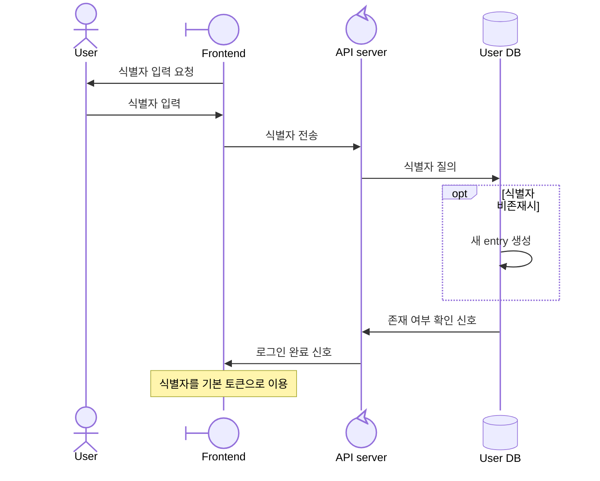
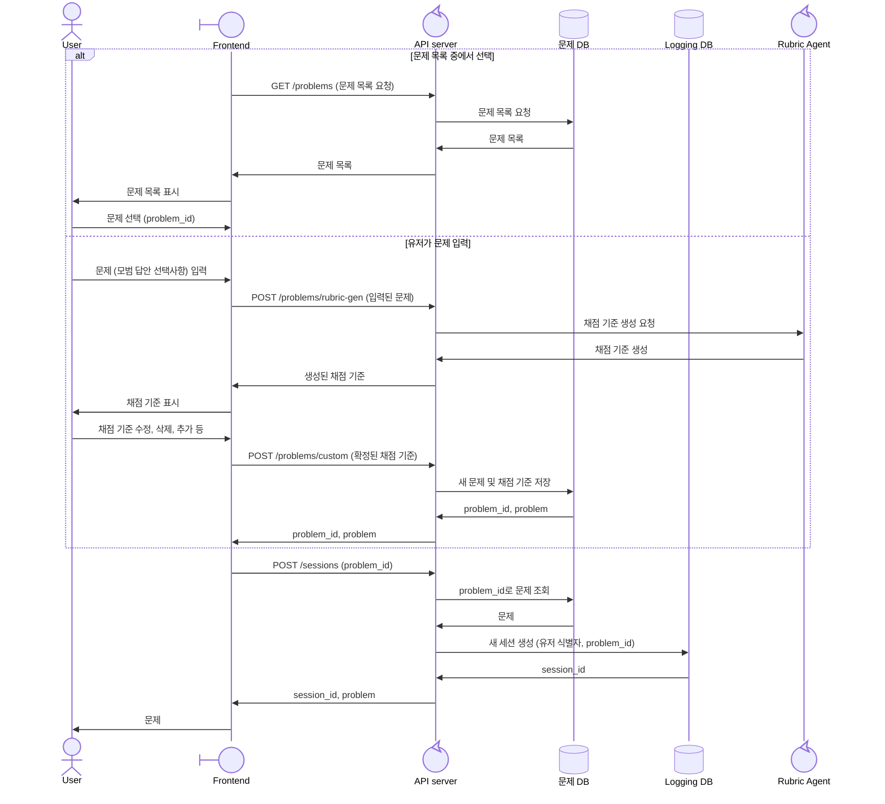
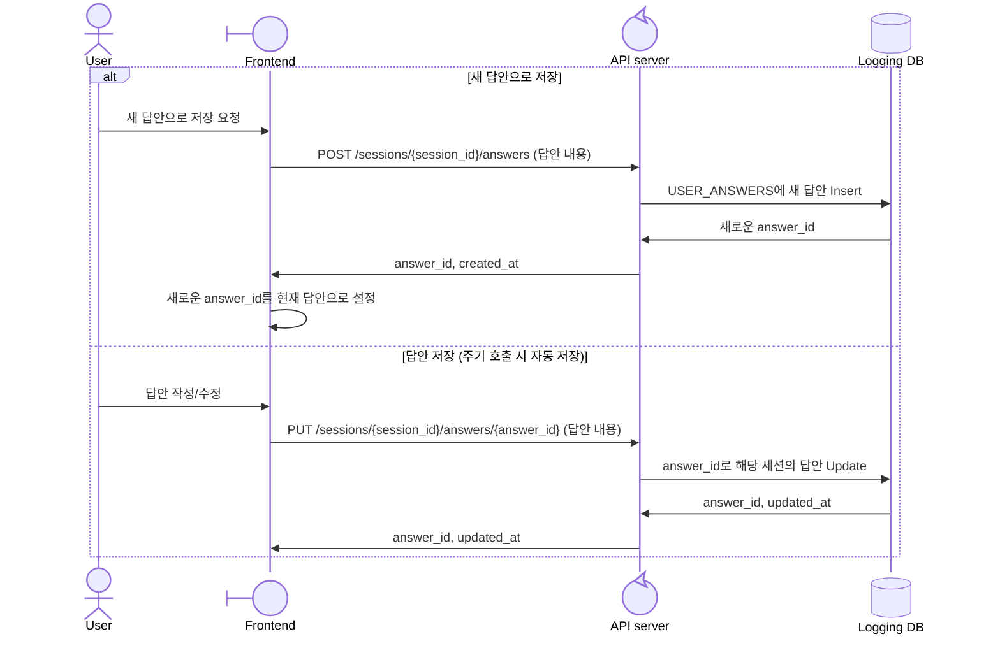
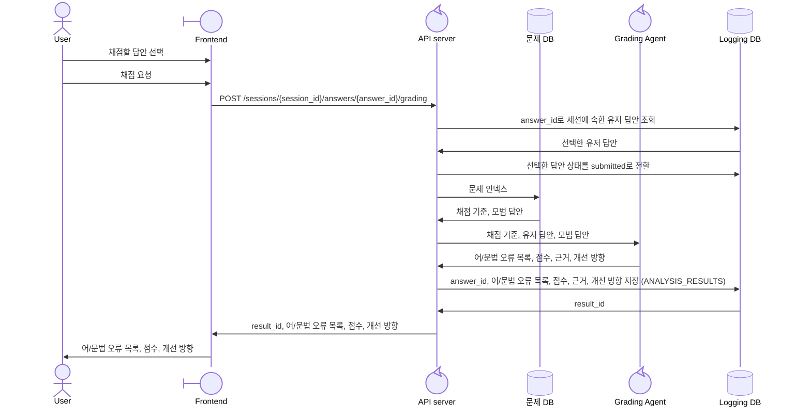
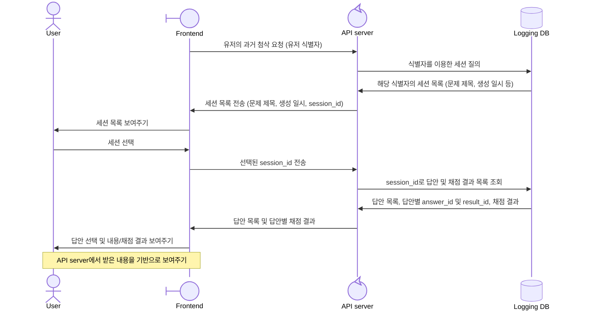
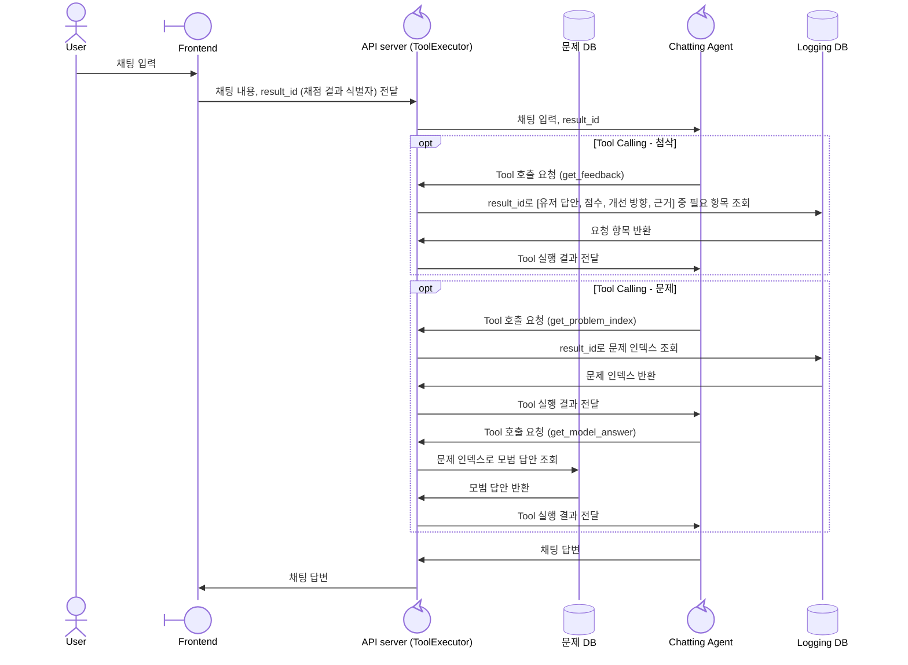

1. 유저 등록 / 로그인

```mermaid
sequenceDiagram
    actor User
    participant Frontend@{ "type" : "boundary" }
    participant API@{ "type" : "control", alias: "API server" }
    participant db@{ "type" : "database" , alias: "User DB"}
    Frontend->>User: 식별자 입력 요청
    User->>Frontend: 식별자 입력
    Frontend->>API: 식별자 전송
    API->>db: 식별자 질의
    opt 식별자 비존재시
    db->>db: 새 entry 생성
    end
    db->>API: 존재 여부 확인 신호
    API->>Frontend: 로그인 완료 신호
    Note over Frontend: 식별자를 기본 토큰으로 이용

```

2. 문제 선택/생성 및 세션 시작

```mermaid
sequenceDiagram
    actor User
    participant Frontend@{ "type" : "boundary" }
    participant API@{ "type" : "control" , alias: "API server"}
    participant problem@{ "type" : "database" , alias: "문제 DB"}
    participant log@{ "type" : "database" , alias: "Logging DB"}
    participant rubric@{ "type" : "control", alias: "Rubric Agent" }
    alt 문제 목록 중에서 선택
    Frontend->>API: GET /problems (문제 목록 요청)
    API->>problem: 문제 목록 요청
    problem->>API: 문제 목록
    API->>Frontend: 문제 목록
    Frontend->>User: 문제 목록 표시
    User->>Frontend: 문제 선택 (problem_id)
    else 유저가 문제 입력
    User->>Frontend: 문제 (모범 답안 선택사항) 입력
    Frontend->>API: POST /problems/rubric-gen (입력된 문제)
    API->>rubric: 채점 기준 생성 요청
    rubric->>API: 채점 기준 생성
    API->>Frontend: 생성된 채점 기준
    Frontend->>User: 채점 기준 표시
    User->>Frontend: 채점 기준 수정, 삭제, 추가 등
    Frontend->>API: POST /problems/custom (확정된 채점 기준)
    API->>problem: 새 문제 및 채점 기준 저장
    problem->>API: problem_id, problem
    API->>Frontend: problem_id, problem
    end
    Frontend->>API: POST /sessions (problem_id)
    API->>problem: problem_id로 문제 조회
    problem->>API: 문제
    API->>log: 새 세션 생성 (유저 식별자, problem_id)
    log->>API: session_id
    API->>Frontend: session_id, problem
    Frontend->>User: 문제
```

3. 답안 저장 / 새 답안으로 저장

```mermaid
sequenceDiagram
    actor User
    participant Frontend@{ "type" : "boundary" }
    participant API@{ "type" : "control" , alias: "API server"}
    participant log@{ "type" : "database" , alias: "Logging DB"}
    alt 새 답안으로 저장
    User->>Frontend: 새 답안으로 저장 요청
    Frontend->>API: POST /sessions/{session_id}/answers (답안 내용)
    API->>log: USER_ANSWERS에 새 답안 Insert
    log->>API: 새로운 answer_id
    API->>Frontend: answer_id, created_at
    Frontend->>Frontend: 새로운 answer_id를 현재 답안으로 설정
    else 답안 저장 (주기 호출 시 자동 저장)
    User->>Frontend: 답안 작성/수정
    Frontend->>API: PUT /sessions/{session_id}/answers/{answer_id} (답안 내용)
    API->>log: answer_id로 해당 세션의 답안 Update
    log->>API: answer_id, updated_at
    API->>Frontend: answer_id, updated_at
    end
```

4. 채점 요청

```mermaid
sequenceDiagram
    actor User
    participant Frontend@{ "type" : "boundary" }
    participant API@{ "type" : "control" , alias: "API server"}
    participant problem@{ "type" : "database" , alias: "문제 DB"}
    participant Agent@{ "type" : "control" , alias: "Grading Agent"}
    participant log@{ "type" : "database" , alias: "Logging DB"}
    User->>Frontend: 채점할 답안 선택
    User->>Frontend: 채점 요청
    Frontend->>API: POST /sessions/{session_id}/answers/{answer_id}/grading
    API->>log: answer_id로 세션에 속한 유저 답안 조회
    log->>API: 선택한 유저 답안
    API->>log: 선택한 답안 상태를 submitted로 전환
    API->>problem: 문제 인덱스
    problem->>API: 채점 기준, 모범 답안
    API->>Agent: 채점 기준, 유저 답안, 모범 답안
    Agent->>API: 어/문법 오류 목록, 점수, 근거, 개선 방향
    API->>log: answer_id, 어/문법 오류 목록, 점수, 근거, 개선 방향 저장 (ANALYSIS_RESULTS)
    log->>API: result_id
    API->>Frontend: result_id, 어/문법 오류 목록, 점수, 개선 방향
    Frontend->>User: 어/문법 오류 목록, 점수, 개선 방향
```

5. 과거 세션 불러오기

```mermaid
sequenceDiagram
    actor User
    participant Frontend@{ "type" : "boundary" }
    participant API@{ "type" : "control" , alias: "API server"}
    participant log@{ "type" : "database" , alias: "Logging DB"}
    Frontend->>API: 유저의 과거 첨삭 요청 (유저 식별자)
    API->>log: 식별자를 이용한 세션 질의
    log->>API: 해당 식별자의 세션 목록 (문제 제목, 생성 일시 등)
    API->>Frontend: 세션 목록 전송 (문제 제목, 생성 일시, session_id)
    Frontend->>User: 세션 목록 보여주기
    User->>Frontend: 세션 선택
    Frontend->>API: 선택된 session_id 전송
    API->>log: session_id로 답안 및 채점 결과 목록 조회
    log->>API: 답안 목록, 답안별 answer_id 및 result_id, 채점 결과
    API->>Frontend: 답안 목록 및 답안별 채점 결과
    Frontend->>User: 답안 선택 및 내용/채점 결과 보여주기
    Note over Frontend, User: API server에서 받은 내용을 기반으로 보여주기
```

6. 채팅

```mermaid
sequenceDiagram
    actor User
    participant Frontend@{ "type" : "boundary" }
    participant API@{ "type" : "control" , alias: "API server (ToolExecutor)"}
    participant problem@{ "type" : "database" , alias: "문제 DB"}
    participant chat@{ "type" : "control" , alias: "Chatting Agent"}
    participant log@{ "type" : "database" , alias: "Logging DB"}
    User->>Frontend: 채팅 입력
    Frontend->>API: 채팅 내용, result_id (채점 결과 식별자) 전달
    API->>chat: 채팅 입력, result_id
    opt Tool Calling - 첨삭
    chat->>API: Tool 호출 요청 (get_feedback)
    API->>log: result_id로 [유저 답안, 점수, 개선 방향, 근거] 중 필요 항목 조회
    log->>API: 요청 항목 반환
    API->>chat: Tool 실행 결과 전달
    end
    opt Tool Calling - 문제
    chat->>API: Tool 호출 요청 (get_problem_index)
    API->>log: result_id로 문제 인덱스 조회
    log->>API: 문제 인덱스 반환
    API->>chat: Tool 실행 결과 전달
    chat->>API: Tool 호출 요청 (get_model_answer)
    API->>problem: 문제 인덱스로 모범 답안 조회
    problem->>API: 모범 답안 반환
    API->>chat: Tool 실행 결과 전달
    end
    chat->>API: 채팅 답변
    API->>Frontend: 채팅 답변
```
