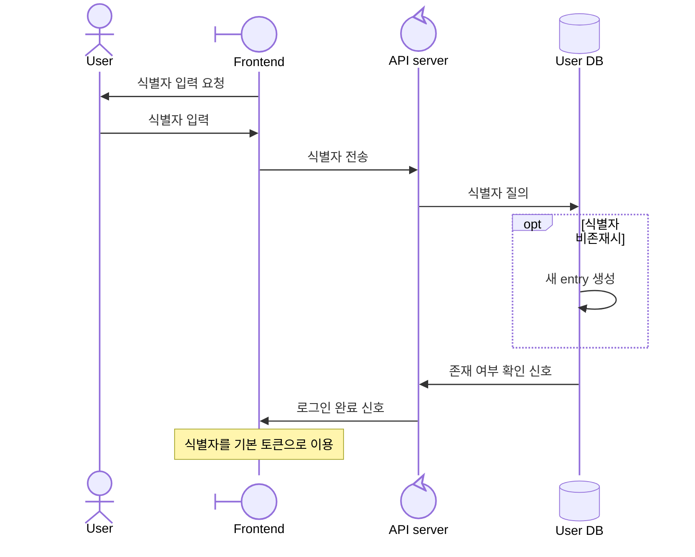
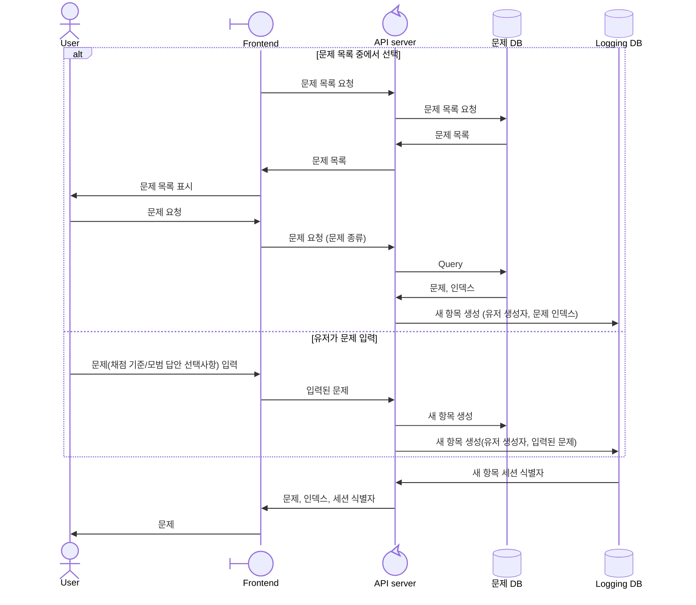
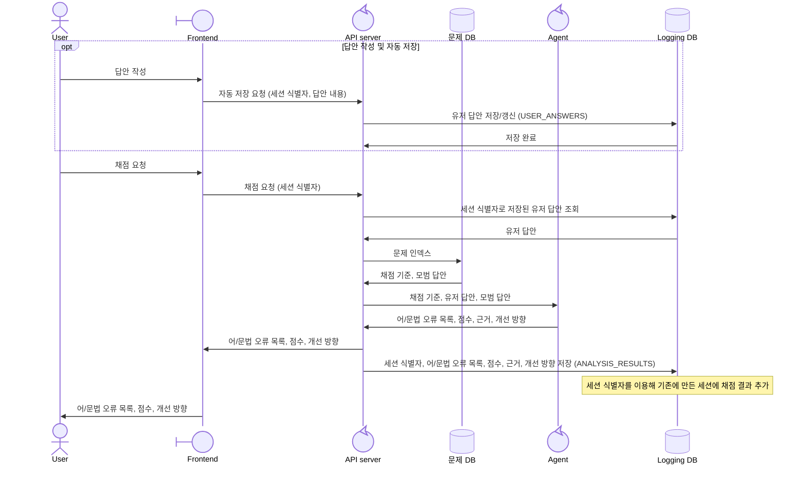
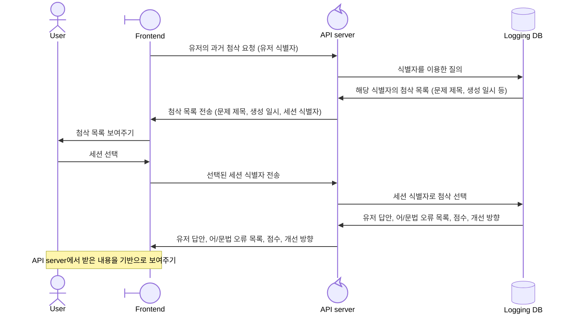
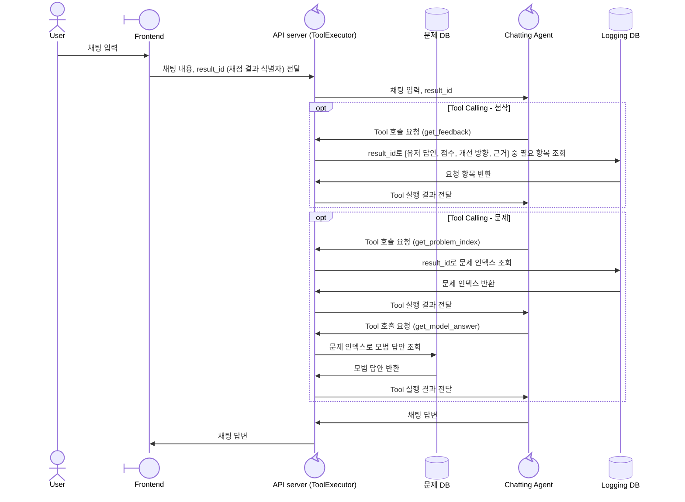

1. 유저 등록 / 로그인

```mermaid
sequenceDiagram
    actor User
    participant Frontend@{ "type" : "boundary" }
    participant API@{ "type" : "control", alias: "API server" }
    participant db@{ "type" : "database" , alias: "User DB"}
    Frontend->>User: 식별자 입력 요청
    User->>Frontend: 식별자 입력
    Frontend->>API: 식별자 전송
    API->>db: 식별자 질의
    opt 식별자 비존재시
    db->>db: 새 entry 생성
    end
    db->>API: 존재 여부 확인 신호
    API->>Frontend: 로그인 완료 신호
    Note over Frontend: 식별자를 기본 토큰으로 이용

```

2. 문제 생성 요청

```mermaid
sequenceDiagram
    actor User
    participant Frontend@{ "type" : "boundary" }
    participant API@{ "type" : "control" , alias: "API server"}
    participant problem@{ "type" : "database" , alias: "문제 DB"}
    participant log@{ "type" : "database" , alias: "Logging DB"}
    alt 문제 목록 중에서 선택
    Frontend->>API:문제 목록 요청
    API->>problem:문제 목록 요청
    problem->>API: 문제 목록
    API->>Frontend: 문제 목록
    Frontend->>User:문제 목록 표시
    User->>Frontend:문제 요청
    Frontend->>API:문제 요청 (문제 종류)
    API->>problem: Query
    problem->>API: 문제, 인덱스
    API->>log: 새 항목 생성 (유저 생성자, 문제 인덱스)
    else유저가 문제 입력
    User->>Frontend: 문제(채점 기준/모범 답안 선택사항) 입력
    Frontend->>API: 입력된 문제
    API->>problem: 새 항목 생성
    API->>log: 새 항목 생성(유저 생성자, 입력된 문제)
    end
    log->>API: 새 항목 세션 식별자
    API->>Frontend: 문제, 인덱스, 세션 식별자
    Frontend->>User: 문제
```

3. 채점 요청

```mermaid
sequenceDiagram
    actor User
    participant Frontend@{ "type" : "boundary" }
    participant API@{ "type" : "control" , alias: "API server"}
    participant problem@{ "type" : "database" , alias: "문제 DB"}
    participant Agent@{ "type" : "control" }
    participant log@{ "type" : "database" , alias: "Logging DB"}
    opt 답안 작성 및 자동 저장
    User->>Frontend: 답안 작성
    Frontend->>API: 자동 저장 요청 (세션 식별자, 답안 내용)
    API->>log: 유저 답안 저장/갱신 (USER_ANSWERS)
    log->>API: 저장 완료
    end
    User->>Frontend: 채점 요청
    Frontend->>API: 채점 요청 (세션 식별자)
    API->>log: 세션 식별자로 저장된 유저 답안 조회
    log->>API: 유저 답안
    API->>problem: 문제 인덱스
    problem->>API: 채점 기준, 모범 답안
    API->>Agent: 채점 기준, 유저 답안, 모범 답안
    Agent->>API: 어/문법 오류 목록, 점수, 근거, 개선 방향
    API->>Frontend: 어/문법 오류 목록, 점수, 개선 방향
    API->>log: 세션 식별자, 어/문법 오류 목록, 점수, 근거, 개선 방향 저장 (ANALYSIS_RESULTS)
    Note over log: 세션 식별자를 이용해 기존에 만든 세션에 채점 결과 추가
    Frontend->>User: 어/문법 오류 목록, 점수, 개선 방향
```

4. 과거 세션 불러오기

```mermaid
sequenceDiagram
    actor User
    participant Frontend@{ "type" : "boundary" }
    participant API@{ "type" : "control" , alias: "API server"}
    participant log@{ "type" : "database" , alias: "Logging DB"}
    Frontend->>API: 유저의 과거 첨삭 요청 (유저 식별자)
    API->>log: 식별자를 이용한 질의
    log->>API: 해당 식별자의 첨삭 목록 (문제 제목, 생성 일시 등)
    API->>Frontend: 첨삭 목록 전송 (문제 제목, 생성 일시, 세션 식별자)
    Frontend->>User: 첨삭 목록 보여주기
    User->>Frontend: 세션 선택
    Frontend->>API: 선택된 세션 식별자 전송
    API->>log: 세션 식별자로 첨삭 선택
    log->>API: 유저 답안, 어/문법 오류 목록, 점수, 개선 방향
    API->>Frontend: 유저 답안, 어/문법 오류 목록, 점수, 개선 방향
    Note over Frontend, User: API server에서 받은 내용을 기반으로 보여주기
```

5. 채팅

```mermaid
sequenceDiagram
    actor User
    participant Frontend@{ "type" : "boundary" }
    participant API@{ "type" : "control" , alias: "API server (ToolExecutor)"}
    participant problem@{ "type" : "database" , alias: "문제 DB"}
    participant chat@{ "type" : "control" , alias: "Chatting Agent"}
    participant log@{ "type" : "database" , alias: "Logging DB"}
    User->>Frontend: 채팅 입력
    Frontend->>API: 채팅 내용, result_id (채점 결과 식별자) 전달
    API->>chat: 채팅 입력, result_id
    opt Tool Calling - 첨삭
    chat->>API: Tool 호출 요청 (get_feedback)
    API->>log: result_id로 [유저 답안, 점수, 개선 방향, 근거] 중 필요 항목 조회
    log->>API: 요청 항목 반환
    API->>chat: Tool 실행 결과 전달
    end
    opt Tool Calling - 문제
    chat->>API: Tool 호출 요청 (get_problem_index)
    API->>log: result_id로 문제 인덱스 조회
    log->>API: 문제 인덱스 반환
    API->>chat: Tool 실행 결과 전달
    chat->>API: Tool 호출 요청 (get_model_answer)
    API->>problem: 문제 인덱스로 모범 답안 조회
    problem->>API: 모범 답안 반환
    API->>chat: Tool 실행 결과 전달
    end
    chat->>API: 채팅 답변
    API->>Frontend: 채팅 답변
```
