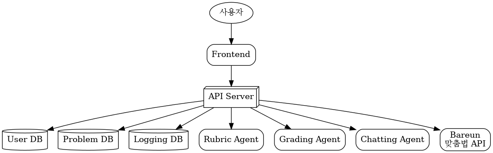
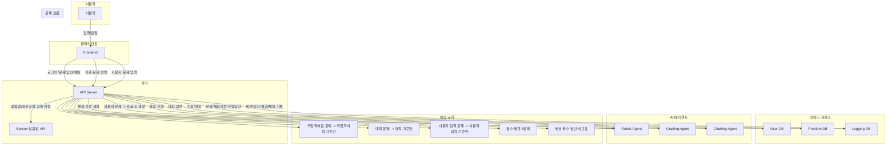

# Paragraphy 워크플로우

## 📊 시스템 다이어그램

## 📝 워크플로우 상세 설명

## 1. 사용자 인증 흐름

1. 사용자 식별자 입력
2. Frontend → API Server로 식별자 전송
3. API Server → User DB 조회
   - 존재하면 로그인 완료
   - 없으면 새 사용자 생성 후 로그인
4. API Server → Frontend 로그인 완료 응답

> 핵심 데이터: `USERS` 테이블

---

## 2. 문제 선택 / 생성 흐름

### 2-1. 기존 문제 선택

1. Frontend가 문제 목록 요청
2. API Server가 Problem DB에서 문제 목록 조회
3. Frontend가 목록 표시
4. 사용자 선택 후 문제 요청
5. API Server가 문제 상세 조회
6. Logging DB에 분석 세션 항목 생성
7. 세션 식별자 발급 → Frontend 전달

### 2-2. 사용자 직접 문제 입력

1. 사용자가 문제 입력
2. Frontend → API Server로 입력된 문제 전송
3. API Server → Rubric Agent에 채점 기준 생성 요청
4. 생성된 Rubric 반환 → Frontend에 표시
5. 사용자 수정/확정
6. API Server가 문제 DB에 새 문제 저장
7. Logging DB에 세션 생성 및 세션 식별자 발급
8. 문제 + 세션 정보 반환

> 핵심 데이터: `PROBLEMS`, `RUBRICS`, `ANALYSIS_SESSIONS`

---

## 3. 답안 작성 및 자동 저장

1. 사용자가 에디터에서 논술 답안 작성
2. Frontend가 일정 주기 또는 입력 종료 후 자동 저장 요청
3. API Server → Logging DB `USER_ANSWERS`에 저장/갱신
4. 답안은 세션 단위로 upsert 방식 저장

> 핵심 데이터: `USER_ANSWERS`

---

## 4. 채점 요청 흐름

1. 사용자가 채점 요청
2. Frontend → API Server로 `session_id` 전송
3. API Server가 Logging DB에서 저장된 유저 답안 조회
4. API Server가 Problem DB에서 문제, 채점 기준, 모범 답안 조회
   - 국립국어원 문제: `국립국어원 채점 기준`만 사용
   - 대학 문제: `대학 채점 기준`만 사용
   - 사용자 입력 문제: `사용자 입력 채점 기준`만 사용
5. API Server → Grading Agent에 채점 요청
6. API Server → 외부 맞춤법/어문 규정 API 호출
   - 공통 기준: `https://bareun.ai/home`
7. Grading Agent 반환:
   - 어/문법 오류 목록
   - 기준별 점수 (5점제)
   - 개선 방향
   - 근거
8. API Server가 Frontend에 결과 반환
9. API Server가 `ANALYSIS_RESULTS`에 저장
10. 세션에 2개 이상의 답안이 존재하면 채점 비교표 생성
    - 각 답안의 기준별 점수 비교
    - 총점 비교
    - 어/문법 오류 개수 비교

> 핵심 데이터: `ANALYSIS_RESULTS`, `USER_ANSWERS`, `PROBLEMS`, `RUBRICS`

---

## 5. 과거 세션 불러오기

1. 사용자 요청으로 과거 세션 목록 조회
2. API Server가 Logging DB에서 해당 사용자 세션 목록 조회
3. Frontend가 목록 표시
4. 사용자가 특정 세션 선택
5. API Server가 선택 세션의 답안, 채점 결과, 첨삭 결과 조회
6. Frontend에 상세 결과 표시

> 핵심 데이터: `ANALYSIS_SESSIONS`, `ANALYSIS_RESULTS`, `USER_ANSWERS`

---

## 6. 채팅 흐름

1. 사용자 채팅 입력
2. Frontend → API Server로 `result_id`와 메시지 전송
3. API Server → Chatting Agent 호출
4. Chatting Agent가 필요 시 Tool Calling 요청
   - `get_feedback`
   - `get_problem_index`
   - `get_model_answer`
5. ToolExecutor가 DB에서 필요한 항목 조회
6. Chatting Agent가 답변 생성
7. API Server → Frontend에 응답 반환

> 핵심 데이터: `CHAT_SESSIONS`, `CHAT_MESSAGES`, 기존 채점 결과

---

## 7. 전체 아키텍처 워크플로우 요약

- 사용자 입력 → Frontend
- Frontend → API Server (단일 진입점)
- API Server → User DB / Problem DB / Logging DB
- API Server → 외부 AI 에이전트
  - Rubric Agent
  - Grading Agent
  - Chatting Agent
- 에이전트 호출 시 ToolExecutor가 DB 조회 담당
- 모든 저장/조회는 API Server 경유

---

## 8. 주요 설계 원칙

- `API Server`가 단일 오케스트레이터
- 에이전트는 저장소 직접 접근 금지
- 채팅 에이전트의 Tool Calling은 `ToolExecutor`가 실행
- 답안은 작성 중 자동 저장, 채점 시 조회 및 상태 전환
- 국립국어원 문제에는 `국립국어원 채점 기준`만 사용
- 대학 문제에는 `대학 채점 기준`만 사용
- 사용자 입력 문제에는 `사용자 입력 채점 기준`만 사용
- 채점 기준별 점수는 `5점제`로 고정
- 맞춤법/어문 규정은 외부 API `https://bareun.ai/home`로 공통 처리
- 세션에 2개 이상의 답안이 있는 경우 채점 비교표를 생성하여 결과를 비교
