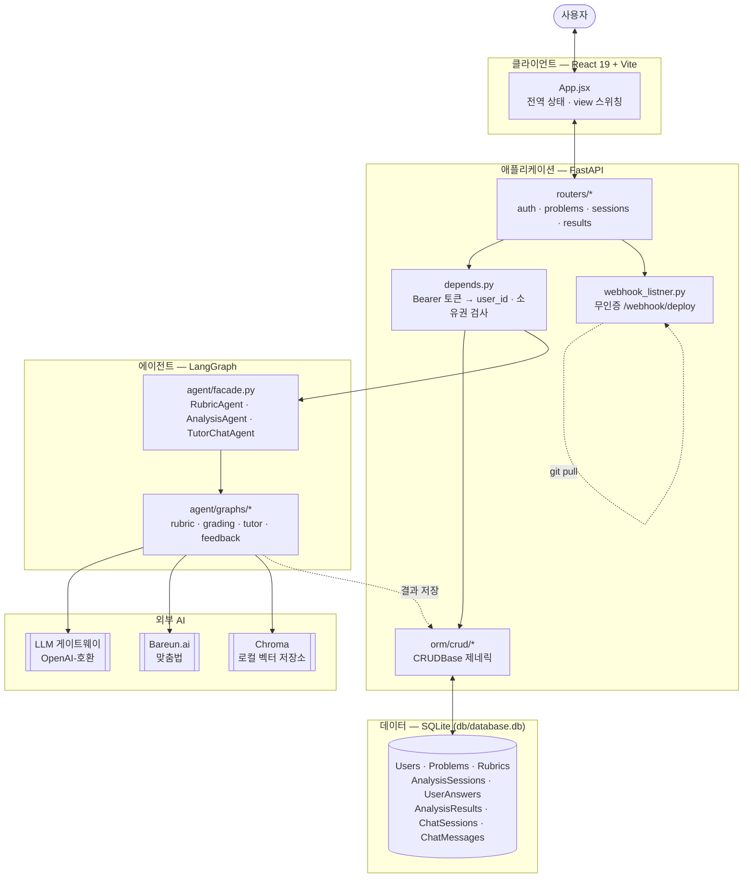
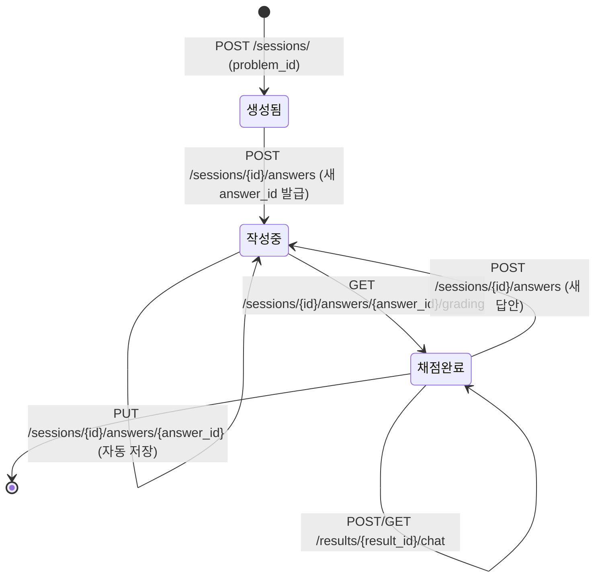

# Paragraphy 컴포넌트 설계서 (As-Built)

## 1. 문서 개요

- **목적**: `frontend/`, `backend/`, `agent/` 실제 코드를 기준으로 시스템의 컴포넌트 구성, 책임, 의존 관계를 기술한다.
- **성격**: 사전 계획 문서인 [`컴포넌트 설계서.md`](./컴포넌트%20설계서.md)와 별도의 **as-built(구현 후) 문서**다. 두 문서가 상충할 경우 이 문서는 실제 코드를 우선한다.
- **근거**: 코드 직접 확인. 파일 경로는 모두 저장소 루트 기준 상대 경로.
- **작성 시점**: 2026-08-18 기준 커밋 상태. 이후 코드가 바뀌면 이 문서도 갱신이 필요하다.
- **읽는 법**: 8절에 계획 문서 대비 실제 구현이 달라진 지점을 표로 정리해 뒀다. 발표에서 "왜 계획과 다르게 됐는지"를 설명할 때는 8절부터 보는 게 빠르다.

| 항목        | 내용                                                                 |
| ----------- | ---------------------------------------------------------------------- |
| 시스템 제목 | Paragraphy                                                              |
| 범위        | 논술 문제 제공, AI 채점/첨삭, 첨삭 기반 채팅, 과거 세션 조회, 배포 자동화 |
| 주요 액터   | 사용자 (로그인 사용자 = `user_name` 문자열 그대로가 곧 식별자이자 토큰) |
| 외부 의존   | LLM 게이트웨이(OpenAI-호환), Bareun.ai(맞춤법), GitHub(배포 웹훅 트리거) |

---

## 2. 아키텍처 개요

- 4계층: 클라이언트(React SPA) → 애플리케이션(FastAPI) → 에이전트(LangGraph) → 데이터(SQLite)
- 계획 문서의 "3계층 + Tool Calling" 구조와 달리, 실제로는 **Tool Calling이 구현되어 있지 않다.** 채팅 에이전트는 채점 결과 전체를 문자열 컨텍스트로 프롬프트에 직접 주입한다 (4.3, 8절 참조).
- 배포 자동화용 웹훅 라우터가 계획에 없던 별도 경로로 추가되어 있다 — DB·에이전트 어느 쪽과도 연결되지 않은 독립 side-channel.

---

## 3. 컴포넌트 목록

| ID   | 컴포넌트         | 유형         | 실제 기술               | 책임 요약                                     |
| ---- | ---------------- | ------------ | ------------------------ | ---------------------------------------------- |
| C-01 | Frontend         | UI           | React 19 + Vite          | 화면 렌더링, 사용자 입력 수집, 전역 상태 보관 |
| C-02 | API Server       | 애플리케이션 | FastAPI + SQLModel       | 요청 라우팅, 인증/소유권 검사, DB·에이전트 오케스트레이션 |
| C-03 | Grading Agent    | 외부 AI      | LangGraph `grading` 그래프 | 답안 채점 및 첨삭 생성                        |
| C-04 | Tutor Chat Agent | 외부 AI      | LangGraph `tutor` 그래프  | 첨삭 결과 기반 대화 응답 생성                 |
| C-05 | Rubric Agent     | 외부 AI      | LangGraph `rubric` 그래프 | 유저 입력 문제에 대한 초기 루브릭 생성        |
| C-06 | SQLite DB        | 저장소       | SQLModel/SQLAlchemy       | 사용자·문제·세션·채점·채팅 전체 데이터 보관   |
| C-07 | Deploy Webhook   | 배포 자동화  | FastAPI `BackgroundTasks` | `git pull`을 트리거하는 무인증 엔드포인트     |

계획 문서에는 없던 **C-07(Deploy Webhook)**이 실제로는 별도 컴포넌트로 존재한다. 계획 문서의 "Chatting Agent"는 실제로 Tool Calling 없이 컨텍스트 주입 방식이라 성격이 달라져 C-04로 재명명했다.

---

## 4. 컴포넌트 상세

### 4.1 C-01 Frontend

**스택** (`frontend/package.json`, `package-lock.json` 기준 실제 설치 버전)

| 항목       | 실제 사용                                        |
| ---------- | -------------------------------------------------- |
| 프레임워크 | React 19.2.8 + react-dom 19.2.8, 순수 JSX (TypeScript 아님) |
| 빌드 도구  | Vite 8.2.1 + `@vitejs/plugin-react` 6.0.5          |
| 라우팅     | **없음** — `App.jsx`의 `view` 문자열 state로 화면 전환 (URL 라우팅 아님) |
| 상태 관리  | **없음** — Redux/Zustand/React Query 미사용, `App.jsx`의 `useState`/`useEffect`로 전역 상태를 직접 들고 props로 내려줌 |
| HTTP 클라이언트 | **없음** — `fetch`를 감싼 자체 `request()` 헬퍼 (`src/api/client.js`) |
| UI/CSS     | **없음** — Tailwind/MUI 등 프레임워크 미사용, `src/styles.css` + `src/styles/legacy.css` 직접 작성 |

**내부 구성**

| 모듈                  | 역할                                                             |
| --------------------- | ------------------------------------------------------------------ |
| `App.jsx`              | 루트 컴포넌트. `entered`/`user`/`view`/`problem`/`session`/`sessions` state를 전부 보유, 화면 전환과 API 호출 오케스트레이션 |
| `main.jsx`             | React 엔트리, `<App/>`을 `StrictMode`로 마운트                     |
| `api/client.js`        | 백엔드 통신 단일 창구 (아래 참조)                                   |
| `components/Landing.jsx` | 로그인 전 스플래시 화면                                          |
| `components/LoginModal.jsx` | 로그인 오버레이 (`username`/`password` 폼, 실제로는 password 미검증) |
| `components/ProblemPicker.jsx` | 기존 문제 목록에서 선택 (`view === 'pick-existing'`)         |
| `components/CustomProblemForm.jsx` | 사용자 문제 직접 입력 + AI 루브릭 생성 (`view === 'pick-custom'`) |
| `components/Workbench.jsx` | 답안 작성/저장/채점 요청, `ResultPanel` 렌더 (`view === 'work'`) |
| `components/HistoryView.jsx` | 과거 세션 목록/비교, `compareOnly` prop으로 두 view 겸용 (`view === 'history' \| 'compare'`) |
| `components/TutorChatModal.jsx` | 채점 완료 후 뜨는 튜터 채팅 모달                              |
| `components/Sidebar.jsx`, `Brand.jsx` | 레이아웃 요소                                          |
| `mocks/api.js`, `mocks/data.js` | 통합 이전 사용한 인메모리 mock — `App.jsx`는 실제 `api/client.js`만 import, 사용 여부는 재확인 필요 (8절) |

**백엔드 통신** (`src/api/client.js`)

- Base URL: `import.meta.env.VITE_API_BASE_URL` (기본값 `http://127.0.0.1:8000`)
- 함수: `login`, `getProblems`, `generateRubric`, `createProblem`, `createSession`, `saveAnswer`, `grade`, `getSessions`, `getSession`, `getChat`, `chat`, `clearToken`
- 인증 토큰: `POST /auth/login` 응답의 `access_token`을 **모듈 레벨 변수(`let accessToken`)에만** 보관 → `localStorage`/`sessionStorage`/쿠키 미사용, 새로고침하면 로그인이 풀림
- 응답 변환: `toProblem`/`toResult`/`toSession` 매퍼가 백엔드 snake_case를 프론트 camelCase 뷰모델로 변환

**의존**: C-02

---

### 4.2 C-02 API Server

- 시스템의 단일 오케스트레이터. 계획 문서와 동일하게 전 경로에서 FastAPI `Depends` 주입 DB 세션을 사용한다.
- 진입점: `backend/server.py` — `lifespan`에서 `create_db_and_table()` + `db_loader.load_problem()` 실행 후 5개 라우터 등록, 미들웨어는 `CORSMiddleware`뿐.

**라우터 (실제 엔드포인트)**

| 모듈                        | 책임                                                              | 실제 경로 |
| ---------------------------- | -------------------------------------------------------------------- | --------- |
| `routers/auth.py`             | 로그인(자동 가입 포함), 현재 사용자 확인                              | `POST /auth/login`, `GET /auth/my` |
| `routers/problems.py`         | 문제 목록 조회, 루브릭 AI 생성, 커스텀 문제 등록                      | `GET /problems/`, `POST /problems/rubric-gen`, `POST /problems/custom` |
| `routers/sessions.py`         | 세션 생성/조회, 답안 저장/갱신, 채점 요청                              | `POST /sessions/`, `GET /sessions/`, `GET /sessions/{id}`, `POST\|PUT /sessions/{id}/answers[/{answer_id}]`, `GET /sessions/{id}/answers/{answer_id}/grading` |
| `routers/results.py`          | 채점 결과 기반 튜터 채팅                                              | `POST /results/{result_id}/chat`, `GET /results/{result_id}/chat` |
| `routers/webhook_listner.py`  | 배포 트리거 (**무인증**)                                              | `POST /webhook/deploy` |

계획 문서의 `/api/v1` 공통 prefix, `X-User-Identifier` 헤더는 실제 코드에 없다 (8절).

**의존성 주입** (`depends.py`)

| 의존                | 역할                                                          |
| --------------------- | ---------------------------------------------------------------- |
| `AuthDep`              | `OAuth2PasswordBearer` — `Authorization: Bearer <username>` 파싱 |
| `UserUUIDDep` → `get_current_user_id` | username으로 `Users` 조회, 없으면 401. **비밀번호·JWT 검증 없음** |
| `*DBDep` (8종)         | `CRUDUser`~`CRUDChatMessage`를 라우트에 주입                       |
| `RubricAgentDep`/`AnalysisAgentDep`/`TutorChatAgentDep` | `agent` 패키지의 어댑터 클래스를 주입           |
| `valid_user_session`(sessions.py), `get_valid_result`(results.py) | 세션/결과의 소유자와 요청자 `user_id` 일치 여부 확인 → 불일치 시 403, 미존재 시 404 |

**저장소 계층** (`orm/`)

- `orm/session.py`: `DATABASE_URL` 미설정 시 `db/database.db` SQLite 파일 사용, `check_same_thread: False`
- `orm/models.py`: 8개 테이블 (`Users`, `Problems`, `Rubrics`, `AnalysisSessions`, `UserAnswers`, `AnalysisResults`, `ChatSessions`, `ChatMessages`) — 컬럼 구조는 [`ERD.md`](./ERD.md)와 정확히 일치함(확인됨). `AnalysisResults.grammar_result`/`criteria_scores`는 `PydanticJSON` 커스텀 `TypeDecorator`로 JSON 컬럼에 Pydantic 모델을 그대로 직렬화
- `orm/crud/_base.py`: 제네릭 `CRUDBase[M, C, U]` — `get`/`get_multi`/`create`/`create_multi`/`update`/`delete`
- `orm/crud/*.py`: 엔티티별 추가 쿼리 — 예) `CRUDProblem.get_criteria`(대학/연도/작성자 필터), `CRUDUser.get_name`, `CRUDAnalysisSession.get_by_user`

**의존**: C-03, C-04, C-05, C-06

---

### 4.3 C-03 / C-04 / C-05 에이전트 (LangGraph)

- 패키지: `agent/` — 백엔드와 분리된 별도 워크스페이스 멤버
- 공개 진입점: `agent/facade.py`의 `RubricAgent`/`AnalysisAgent`/`TutorChatAgent` — `shared/protocol.py`의 Protocol을 구현, FastAPI 레이어는 이 세 클래스의 `.run()`만 호출하고 LangGraph 내부 상태는 모른다.
- 그래프: `agent/graphs/{rubric,grading,tutor,feedback}.py`, `.ainvoke()`로 비동기 실행
- 외부 연동:
  - **LLM 게이트웨이** (`agent/model.py`): `langchain.chat_models.init_chat_model(provider="openai", base_url=...)` — OpenAI-호환 게이트웨이라면 벤더 무관하게 연결, `.with_structured_output()`으로 Pydantic 스키마 강제 출력
  - **Bareun** (`agent/integrations/spelling.py`): `bareunpy.Corrector.correct_error()` — 한국어 맞춤법/문법 교정
  - **Chroma** (`agent/integrations/retrieval.py`): `chromadb.PersistentClient` — RAG용 로컬 벡터 저장소, 지연 import로 선택적 의존성 처리

**Tool Calling — 계획과의 가장 큰 차이**

- 계획 문서(9절)는 "Chatting Agent가 Tool로 필요 항목만 조회, `result_id`는 ToolExecutor가 강제 주입"하는 구조를 전제했다.
- 실제 `routers/results.py`의 `chat_with_tutor`는 Tool Calling을 쓰지 않는다. 채점 결과·문제·답안 전체를 `AnalysisResultPublicWithProblemAnswer.model_dump_json()`으로 직렬화해 `TutorChatInput.context_text`에 그대로 넣어 프롬프트 컨텍스트로 전달한다.
- 즉 계획 문서가 걱정했던 "에이전트가 임의의 `result_id`로 Tool을 호출"하는 위험 시나리오 자체가 지금 코드에는 없다 — Tool이 없으니 Tool 오남용도 없다. 대신 매 채팅 요청마다 채점 결과 전체를 컨텍스트로 밀어넣는 토큰 비용은 그대로 남아 있다.

**의존**: 없음 (외부 AI 서비스 호출만)

---

### 4.4 C-06 데이터 저장소

| 항목      | 계획 문서                         | 실제 구현                                                     |
| --------- | ------------------------------------ | ---------------------------------------------------------------- |
| 엔진      | PostgreSQL 단일 인스턴스              | **SQLite** 파일 (`db/database.db`), `DATABASE_URL` 환경변수로 교체 가능 |
| 유동 컬럼 | JSONB                                 | SQLModel `JSON` + 커스텀 `PydanticJSON TypeDecorator`             |
| 스키마    | User DB / 문제 DB / Logging DB 논리 분리 | 8개 테이블 모두 같은 SQLite 파일 한곳에 존재, 논리적 분리 없음      |

ERD 자체(테이블/컬럼 구조)는 계획 문서의 [`ERD.md`](./ERD.md)와 실제 `orm/models.py`가 정확히 일치한다 — 바뀐 건 물리 엔진뿐이다.

---

### 4.5 C-07 Deploy Webhook (신규, 계획에 없음)

- `routers/webhook_listner.py`: `POST /webhook/deploy` → `BackgroundTasks.add_task(run_git_pull)` → `subprocess.run(["git", "pull", "origin", "main"])`
- **인증·서명 검증 없음.** CORS 미들웨어만 거치고 `Depends`를 전혀 쓰지 않는 유일한 라우터.
- DB·에이전트 어느 쪽과도 연결되지 않은 독립 경로 — 이 요청이 실패해도 서비스의 나머지 기능에는 영향이 없다.

---

## 5. 세션 생명주기 (실제 구현 기준)

- `UserAnswers.status`는 `Status` StrEnum(`draft`/`submitted`)이지만, 실제로 `submitted`로 전환하는 코드는 라우터에 없다 — `insert_session_answer`/`update_session_answer`는 프론트가 보낸 `status` 값을 그대로 저장할 뿐, 채점 시점에 서버가 강제로 바꾸지 않는다 (계획 문서 4.2절 "채점 요청은 상태를 `submitted`로 전환"과 다른 지점).
- 채점(`analysis_answer`)은 같은 `answer_id`에 대해 이미 `AnalysisResults`가 있으면 새로 만들지 않고 `update` — 재채점이 새 행이 아니라 덮어쓰기로 동작한다.

---

## 6. 인증 방식 (실제)

- 헤더: `Authorization: Bearer <username>` (계획 문서의 `X-User-Identifier`가 아님)
- `POST /auth/login`은 `OAuth2PasswordRequestForm`(username/password 폼)을 받지만 **password는 검증하지 않는다** — username이 DB에 없으면 그 자리에서 자동 가입 후 username 문자열 자체를 `access_token`으로 반환한다.
- 서명도 만료도 없는 토큰 — 누군가의 username만 알면 그 사용자로 로그인한 것과 동일한 권한을 얻는다.
- 소유권 검사(`valid_user_session`, `get_valid_result`)는 유지된다 — 계획 문서가 명시한 "인증이 아닌 데이터 정합성 목적"의 예외 규칙과 일치.

---

## 7. 컴포넌트 간 의존 관계 요약

| From             | To                                  | 방식                          |
| ---------------- | ------------------------------------ | -------------------------------- |
| Frontend         | API Server                           | HTTP (`fetch`, `Bearer` 헤더)   |
| API Server       | SQLite DB                            | SQLModel `Session` (SQLite 파일) |
| API Server       | Rubric/Grading/Tutor Agent           | 함수 호출 (`agent` 패키지 직접 import, LLM API 아님) |
| Grading/Rubric/Tutor Agent | LLM 게이트웨이 / Bareun / Chroma | HTTP/gRPC (외부 서비스)        |
| 외부(GitHub 등)  | API Server (`/webhook/deploy`)       | HTTP, **무인증**                |

계획 문서와 달리 API Server와 Agent는 별도 프로세스/LLM API 호출 관계가 아니라 **같은 프로세스 안에서 Python 함수 호출**로 연결된다 (`agent`가 `backend`의 workspace 의존성으로 직접 import됨) — 계획 문서 2절의 "API Server ↔ Rubric/Grading/Chatting Agent : LLM API" 화살표는 실제로는 프로세스 내부 호출이다.

---

## 8. 계획 문서 대비 실제 구현 차이 요약

| 항목                     | 계획 (`컴포넌트 설계서.md`)                          | 실제 구현                                                        |
| -------------------------- | -------------------------------------------------------- | ---------------------------------------------------------------- |
| DB 엔진                    | PostgreSQL 단일 인스턴스, JSONB                           | SQLite 파일, `PydanticJSON` TypeDecorator                          |
| 인증 헤더                  | `X-User-Identifier`                                       | `Authorization: Bearer <username>` (`OAuth2PasswordBearer`)       |
| Base URL                   | `/api/v1` 공통 prefix                                     | prefix 없음, 라우터별 `/auth`·`/problems`·`/sessions`·`/results`·`/webhook`만 |
| Agent ↔ API Server 관계   | "LLM API" 호출 (별도 서비스 암시)                          | 같은 프로세스 내 Python 함수 호출 (`agent` 패키지 직접 import)     |
| Tool Calling / ToolExecutor | 채팅 에이전트가 Tool로 결과 조회, `result_id` 강제 주입 규칙 | **미구현** — 채점 결과 전체를 컨텍스트 문자열로 프롬프트에 직접 주입 |
| MCP 서버                   | 도입 보류, 재검토 조건 명시                                | 여전히 미도입, 재검토 조건 미충족                                   |
| 배포 자동화                | 문서에 없음                                                | `POST /webhook/deploy` 신규 추가, **무인증**                       |
| 프론트 상태관리/라우팅      | 명시 없음                                                  | 별도 라이브러리 없이 `App.jsx` 로컬 state로 전부 처리               |
| 답안 상태 전환              | 채점 요청 시 서버가 `submitted`로 전환                      | 서버가 강제 전환하지 않음, 프론트가 보낸 값 그대로 저장              |
| 토큰 저장                  | 범위 밖 (언급 없음)                                        | 프론트가 메모리 변수에만 보관 — 새로고침 시 로그아웃                 |

---

## 9. 리스크 및 개선 제안 (as-built 관찰)

- **배포 웹훅 무인증**: `/webhook/deploy`는 서명·인증 없이 누구나 호출해 서버에 `git pull`을 실행시킬 수 있다. GitHub webhook secret 검증 또는 최소한의 shared-secret 헤더 도입을 권장.
- **인증이 신원 확인이 아님**: username을 아는 사람은 누구나 그 사용자로 로그인할 수 있다. 계획 문서도 "인증 절차 미도입"을 팀 합의로 명시했으니 의도된 제약이지만, 공개 배포 전 재검토가 필요하다는 계획 문서의 단서(7절)는 여전히 유효하다.
- **프론트 토큰 미영속화**: 세션 스토리지 등에 저장하지 않아 새로고침마다 재로그인이 필요하다 — 계획 문서에는 없던 사용성 이슈.
- **`mocks/` 디렉터리 정리 여부 확인**: `App.jsx`는 실제 `api/client.js`만 import하므로 `mocks/api.js`·`mocks/data.js`는 사용되지 않는 것으로 보이나, 삭제된 것은 아니라 죽은 코드로 남아 있을 가능성이 있다.
- **재채점이 덮어쓰기**: `AnalysisResults`가 `answer_id`당 1개로 갱신되므로, 계획 문서 10절 미확정 사항 #3("여러 번 채점 가능성")의 이력이 남지 않는다 — 필요하면 별도 결정이 필요하다.
