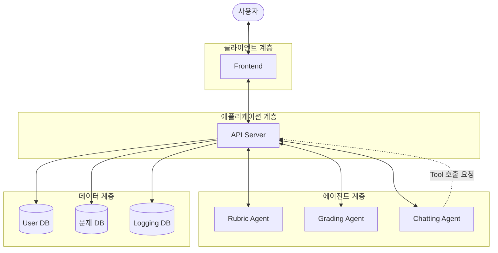
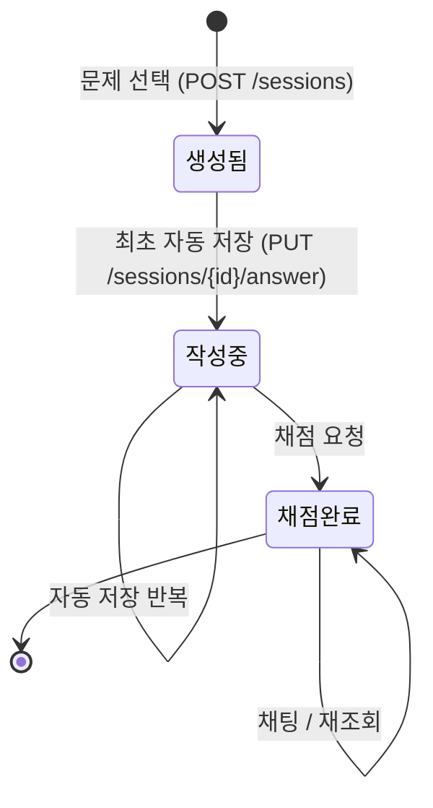

# Paragraphy 컴포넌트 설계서

## 1. 문서 개요

- 목적: Paragraphy 시스템의 컴포넌트 구성, 각 컴포넌트의 책임과 인터페이스, 컴포넌트 간 의존 관계 정의
- 근거 문서: `유스케이스 명세서.md`, `시퀀스 다이어그램.md`
- 기술 수준 상충 시 기준: ERD 및 시퀀스 다이어그램 우선 (ERD의 테이블/컬럼 명칭 준수, Logging DB, 세션 식별자, Tool Calling 등 포함)

| 항목        | 내용                                                         |
| ----------- | ------------------------------------------------------------ |
| 시스템 제목 | Paragraphy                                                   |
| 범위        | 논술 문제 제공, AI 채점/첨삭, 첨삭 기반 채팅, 과거 세션 조회 |
| 주요 액터   | 사용자                                                       |
| 외부 의존   | LLM API (Rubric Agent, 채점 에이전트, 채팅 에이전트)         |

---

## 2. 아키텍처 개요

- 3계층 구조: 클라이언트 - 애플리케이션 - 데이터
- Frontend는 사용자 상호작용 전담, 데이터 접근·에이전트 호출은 전량 API Server 경유
- 에이전트 Tool Calling도 동일 원칙 적용
  - LLM은 저장소 직접 접속 불가
  - Tool Calling의 범위는 호출 함수명·인자 지정까지
  - 실제 실행 주체는 API Server의 ToolExecutor (9절 참조)
- 결과: 데이터 접근 경로 단일화



---

## 3. 컴포넌트 목록

| ID   | 컴포넌트       | 유형         | 책임 요약                                                  |
| ---- | -------------- | ------------ | ---------------------------------------------------------- |
| C-01 | Frontend       | UI           | 화면 렌더링, 사용자 입력 수집, 세션 상태 보관              |
| C-02 | API Server     | 애플리케이션 | 요청 라우팅, 비즈니스 로직, 저장소·에이전트 오케스트레이션 |
| C-03 | Grading Agent  | 외부 AI      | 답안 채점 및 첨삭 생성                                     |
| C-04 | Chatting Agent | 외부 AI      | 첨삭 결과 기반 대화 응답 생성                              |
| C-05 | User DB        | 저장소       | 사용자 식별자 관리                                         |
| C-06 | 문제 DB        | 저장소       | 문제, 채점 기준, 모범 답안 보관                            |
| C-07 | Logging DB     | 저장소       | 세션, 답안, 채점 결과, 채팅 이력 보관                      |
| C-08 | Rubric Agent   | 외부 AI      | 유저 입력 문제에 대한 초기 채점 기준(루브릭) 생성          |

---

## 4. 컴포넌트 상세

### 4.1 C-01 Frontend

**책임**

- 로그인 화면에서 식별자 입력 요청 및 수집
- 문제 목록 조회 및 문제 선택 UI 제공
- 답안 작성 에디터 제공, 채점 요청 전송
  - 작성 중 자동 저장 요청 전송 (디바운스 적용, 마지막 입력 후 일정 시간 경과 시)
  - 저장 실패 시 사용자에게 미저장 상태 표시
- 채점 결과 탭 단위 렌더링
  - 채점 결과 탭: 항목별 점수, 총평
  - 첨삭 탭: 기준별 첨삭 내용, 어/문법 오류 영역
- 과거 첨삭 목록 및 상세 내용 표시
- 채팅 UI 제공
- 로그인 시 수신한 식별자 보관, 이후 요청에 첨부
- 현재 활성 세션 식별자 보관

**내부 구성**

| 모듈            | 역할                                          |
| --------------- | --------------------------------------------- |
| AuthView        | 식별자 입력 및 로그인 처리                    |
| ProblemListView | 문제 목록 조회 및 필터링, 새 문제 입력        |
| EditorView      | 답안 작성, 채점 요청                          |
| ResultView      | 채점 결과 탭 / 첨삭 탭 렌더링                 |
| HistoryView     | 과거 세션 목록 및 상세                        |
| ChatView        | 채팅 입출력                                   |
| ApiClient       | API Server 통신, 식별자·세션 식별자 자동 첨부 |

**의존**: C-02

---

### 4.2 C-02 API Server

- 시스템의 단일 오케스트레이터
- Frontend 요청 전량 처리, 저장소·에이전트 호출 순서 결정

**내부 모듈**

| 모듈          | 책임                                                            | 의존             |
| ------------- | --------------------------------------------------------------- | ---------------- |
| AuthModule    | 식별자 조회, 미존재 시 등록, 로그인 응답                        | C-05             |
| ProblemModule | 문제 목록/새 문제 입력/단건 조회, 루브릭 생성 요청              | C-06, C-08       |
| SessionModule | 세션 생성, 세션 목록/상세 조회                                  | C-07             |
| AnswerModule  | 답안 원문 저장/갱신/조회, 제출 상태 전환                        | C-07             |
| GradingModule | 채점 기준 조회, 채점 에이전트 호출, 결과 저장                   | C-03, C-06, C-07 |
| ChatModule    | 채팅 에이전트 호출, 대화 이력 관리                              | C-04, C-07       |
| AgentGateway  | LLM 호출 공통 처리 (타임아웃, 재시도, 프롬프트 조립, 응답 파싱) | C-03, C-04, C-08 |
| ToolExecutor  | 에이전트 Tool 호출 요청 수신, 실행, 결과 반환                   | C-06, C-07       |

**저장소 접근 방식**

- 전 경로에서 FastAPI `Depends` 주입 DB 세션 사용
- ToolExecutor의 Tool 함수도 동일 의존성 사용 → 엔드포인트 경로와 Tool 경로가 동일 통로 통과
- 접근 검사·감사 로그 추가 시 주입 함수 단일 지점만 수정

**핵심 처리 규칙**

- 세션 생성 시점: 문제 요청 시 Logging DB에 항목 생성 후 세션 식별자 발급
  - 세션 시작 키: `유저 식별자 + 문제 인덱스`
  - 이후 채점 결과·채팅 이력이 동일 세션에 누적
- 채점 응답과 저장 간 순서 의존 없음 → 응답 선전송, 저장은 비동기 처리
- 답안 원문 저장 규칙
  - 채점 결과와 분리하여 `answers` 테이블에 보관
  - 작성 중 자동 저장 요청 시 동일 행 갱신 (세션당 1행, upsert)
  - 채점 요청 시 저장된 원문을 조회하여 사용, 상태를 `submitted`로 전환
  - 채점 실패 시에도 원문 보존 (재요청 가능)
- 채점 결과 중 `근거(rationale)`는 Frontend 미전송, Logging DB에만 저장
  - 채팅 에이전트가 필요 시 Tool로 참조
- **채점 배점 표준**: 모든 채점 기준 및 루브릭 산정은 **5점 만점제(5-point scale)**를 기본 단위로 적용 (Rubric Agent 및 Grading Agent 공통)

---

### 4.3 C-03 Grading Agent

- 입력: 채점 기준, 모범 답안, 사용자 답안
- 출력: 어/문법 오류 목록, 기준별 점수, 근거, 개선 방향

**출력 스키마(안)**

```json
{
  "grammar_errors": [
    { "offset": 0, "length": 0, "original": "", "suggestion": "", "type": "" }
  ],
  "criteria_scores": [
    {
      "criterion": "",
      "score": 0,
      "max_score": 5,
      "rationale": "",
      "improvement": ""
    }
  ],
  "total_score": 0,
  "overall_comment": ""
}
```

**요구사항**

- 출력은 구조화 JSON으로 강제, 파싱 실패 시 AgentGateway가 재시도
- **5점 만점제 적용**: 각 평가 기준의 배점(`max_score`)은 5점으로 고정/기본 설정되며, 점수(`score`)는 5점 만점 기준으로 평가
- 기준 개수는 문제별 상이 → `criteria_scores`는 가변 길이 배열로 처리
- `offset`/`length`는 첨삭 탭 원문 하이라이팅에 사용

---

### 4.4 C-04 Chatting Agent

- 입력: 사용자 채팅 메시지, 채점 결과 식별자(`result_id`), 대화 이력
- 출력: 자연어 답변

**Tool 정의**

- 스키마는 에이전트에 노출, **실행 주체는 API Server의 ToolExecutor**
- 에이전트 반환 범위: 함수명 + 인자
- 저장소 조회 수행: ToolExecutor

| Tool                | 파라미터            | 반환                                          | 조회 대상 |
| ------------------- | ------------------- | --------------------------------------------- | --------- |
| `get_feedback`      | result_id, fields[] | 유저 답안, 점수, 개선 방향, 근거 중 요청 항목 | C-07      |
| `get_problem_index` | result_id           | 문제 인덱스                                   | C-07      |
| `get_model_answer`  | problem_index       | 모범 답안                                     | C-06      |

**설계 의도**

- 전체 채점 결과 대신 필요 항목만 Tool로 조회
  - 토큰 비용 절감
  - 장문 답안으로 인한 context 초과 방지
- `result_id`는 에이전트 생성 값 미신뢰, ToolExecutor가 현재 요청의 `result_id`로 덮어씀
  - 위험 시나리오: 사용자가 채팅창에 "다른 세션 내용을 보여줘" 등을 입력할 경우, 에이전트가 임의의 식별자로 Tool 호출 시도 가능
  - 근거: 에이전트의 Tool 인자는 사용자 입력의 영향을 받는 값이므로 신뢰 불가
  - 인증 유무와 무관하게 적용 (인증 미도입 상태에서도 필요)
  - 구현: ToolExecutor가 인자 병합 시 요청 컨텍스트의 `result_id`를 우선 적용
  - 상태: 팀 미논의 항목, 검토 필요 (10절 #7)

---

### 4.5 C-08 Rubric Agent

- 입력: 유저 작성 문제 내용(`content`), 모범 답안(`model_answer`, 선택)
- 출력: AI가 제안하는 초기 채점 기준 목록(루브릭)

**출력 스키마(안)**

```json
{
  "rubrics": [
    {
      "criterion": "평가 항목 명칭",
      "max_score": 5,
      "description": "채점 세부 가이드라인 및 감점 요인"
    }
  ]
}
```

**요구사항**

- 유저가 입력한 문제(및 선택적 모범 답안)를 분석하여 세부 채점 기준 및 배점(기본 5점 만점) 자동 생성
- 출력은 구조화 JSON으로 강제, 파싱 실패 시 AgentGateway가 재시도
- 생성된 기준은 프론트엔드로 전달되어 유저가 화면에서 자유롭게 수정/추가/삭제할 수 있는 인터페이스 제공

---

### 4.6 C-05 / C-06 / C-07 데이터 저장소

- 구성: RDB(PostgreSQL) 단일 인스턴스, 논리적 스키마 분리
- 구조 유동 데이터(문제, 채점 결과)는 JSONB 컬럼 저장
- ERD는 [해당 파일](./ERD.md) 참조

| 저장소     | 대응 테이블                                             |
| ---------- | ------------------------------------------------------- |
| User DB    | `USERS`                                                 |
| 문제 DB    | `PROBLEMS`, `RUBRICS`                                   |
| Logging DB | `ANALYSIS_SESSIONS`, `USER_ANSWERS`, `ANALYSIS_RESULTS` |

**답안 원문 저장 (`USER_ANSWERS`)**

- 저장 위치: 채점 결과와 분리된 독립 테이블
- 분리 사유
  - 채점 에이전트 호출 실패 시에도 원문 보존 필요 (작성 시간이 긴 논술 특성)
  - 자동 저장 요구사항상 채점 이전에 원문이 존재해야 함
  - 재채점 허용 시 동일 원문의 중복 저장 방지
  - 하나의 문제 세션에서 답안을 수정하며 여러 번 채점 가능성
- `status` 값: `draft`(작성 중) / `submitted`(채점 요청됨)
- `ANALYSIS_RESULTS`는 `answer_id`를 참조 → 재채점 발생 시 어느 원문에 대한 채점인지 추적 가능

**JSONB 적용 기준**

- `ANALYSIS_RESULTS` 내 `scores`, `corrections`, `agent_results` JSON 컬럼: 어/문법 오류 목록, 기준별 점수·근거·개선 방향 저장
- 효과: 프롬프트 수정으로 출력 필드 증감 시 마이그레이션 불필요

---

## 5. 인터페이스 명세

| #   | Method | Path                     | 요청                                        | 응답                          | 유스케이스                                             |
| --- | ------ | ------------------------ | ------------------------------------------- | ----------------------------- | ------------------------------------------------------ |
| 1   | POST   | `/auth/login`            | `identifier`                                | `user_id`, `is_new`           | 유저 등록/로그인                                       |
| 2   | GET    | `/problems`              | `university`, `year`, `type` (query)        | 문제 목록                     | 문제 생성 요청                                         |
| 3   | POST   | `/sessions`              | `problem_id`                                | `session_id`, `problem`       | 문제 생성 요청                                         |
| 3a  | POST   | `/problems/rubric`       | `content`, `model_answer` (선택)            | `rubrics`                     | 문제 생성 요청 (채점 기준 자동 생성)                   |
| 3b  | POST   | `/problems/custom`       | `content`, `model_answer` (선택), `rubrics` | `session_id`, `problem`       | 문제 생성 요청 (유저 문제/확정 기준 저장 및 세션 생성) |
| 4   | PUT    | `/sessions/{id}/answer`  | `user_answer`                               | `updated_at`                  | 채점 (자동 저장)                                       |
| 5   | POST   | `/sessions/{id}/grading` | — (저장된 답안 사용)                        | 어/문법 오류, 점수, 개선 방향 | 채점                                                   |
| 6   | GET    | `/sessions`              | —                                           | 세션 목록                     | 과거 세션 불러오기                                     |
| 7   | GET    | `/sessions/{id}`         | —                                           | 답안, 채점 결과               | 과거 세션 불러오기                                     |
| 8   | POST   | `/results/{id}/chat`     | `message`                                   | 답변                          | 채팅                                                   |

**전제 및 운영 방침**

- 사용자 식별자는 헤더 전달, 2번 제외 전 엔드포인트 필수
- 채점 호출 순서: 4번(최종 내용 저장) → 5번(채점 요청)
  - 5번은 요청 본문을 받지 않고 저장된 원문을 사용 → 자동 저장분과 채점 대상의 불일치 방지
  - 4번 미선행 시 5번은 오류 반환
- 7번 응답의 답안은 `USER_ANSWERS.user_answer` 기준
- 8번 채팅 요청의 `{id}`는 `result_id`(채점 결과 식별자) 기준 (`CHAT_SESSIONS`가 `ANALYSIS_RESULTS` 참조)
- 해당 식별자의 성격: 인증 수단 아님, 대상 사용자 특정 용도 (7절 참조)
- 본 표를 개발 착수 전 프론트엔드·백엔드 합의 계약으로 사용
- FastAPI `/docs` 자동 생성 문서는 구현 이후 산출물 → 사전 합의 용도 부적합, 구현 확인용으로 한정
- 개발 중 변경 사항은 본 표에 반영

---

## 6. 세션 생명주기



- 세션 생성 시점: 문제 선택 시
- 세션의 역할: 답안 원문, 채점 결과, 채팅 이력의 보관 단위
- `작성중` 진입 조건: 최초 자동 저장 성공 (`answers.status = draft`)
- `채점완료` 진입 시 `answers.status`가 `submitted`로 전환
- 채팅 전제 조건: 채점 선행 (미선행 시 유효 context 부재)

---

## 7. 횡단 관심사

**인증**

- 팀 합의에 따라 인증 절차 미도입
- 식별자 용도: 사용자 구분 한정
- 범위 밖: 비밀번호, 토큰 발급, 만료 처리
- 결과 제약: API Server의 요청자 신원 미검증 → 식별자 인지 시 해당 사용자 첨삭 이력 조회 가능
- 상태: 인지된 제약, 서비스 공개 배포 시 재검토 대상
- 예외 유지 항목: 세션 소유권 검사(`session_id` 소유자와 요청 헤더 식별자 일치 여부)
  - 사유: 인증이 아닌 데이터 정합성 목적

**에이전트 실패 처리**

- 예상 실패 유형: 타임아웃, JSON 파싱 실패, 레이트 리밋
- 대응: AgentGateway에서 재시도 (지수 백오프, 최대 2회)
- 최종 실패 시: 세션 상태 유지, 오류 반환하여 사용자 재요청 허용

**응답 지연**

- 논술 채점 소요 시간: 수십 초 예상
- 검토 대상: 스트리밍 방식 또는 작업 큐 + 폴링 방식

**로깅**

- Logging DB의 성격: 서비스 데이터 저장소, 애플리케이션 로그와 분리
- 개선 권고: 명칭 혼동 방지를 위한 `Session DB` 등으로 개명

---

## 8. 컴포넌트 간 의존 관계 요약

| From           | To                                            | 방식           |
| -------------- | --------------------------------------------- | -------------- |
| Frontend       | API Server                                    | HTTP           |
| API Server     | User DB / 문제 DB / Logging DB                | DB 커넥션      |
| API Server     | Rubric Agent / Grading Agent / Chatting Agent | LLM API        |
| Chatting Agent | API Server (ToolExecutor)                     | Tool 호출 요청 |

---

## 9. 설계 판단 및 대안

**Tool 실행 주체 (결정)**

- 시퀀스 다이어그램상 Chatting Agent → Logging DB / 문제 DB 직접 화살표 존재
- 해당 화살표의 성격: 논리적 데이터 흐름 표현, 물리적 연결 아님
- 근거: LLM의 저장소 직접 접속 불가
- 결정: **API Server 내부 ToolExecutor가 실행**

**MCP 서버 도입 (보류)**

- 검토 후 현 단계 미채택
- 미채택 사유
  - 인증 절차 부재로 계층에서 검사할 권한 정보 없음
  - 배포 단위 및 장애 지점 증가
  - MCP가 접근 제어 로직을 대체 구현하지 않음
- 재검토 조건 (하나 이상 성립 시)
  - 에이전트 복수화로 동일 Tool 공유 필요 발생
  - 에이전트를 별도 서비스 또는 타 언어로 분리
  - 외부 MCP 클라이언트의 본 시스템 Tool 사용 필요
- 이관 비용: Tool 함수 본문 재사용 가능 → 변경 범위는 호출 계층에 한정

**문제 DB와 Logging DB 분리**

- 논리적 분리 상태이나 물리적 동일 인스턴스 사용 무방
- 접근 특성: 문제 데이터는 읽기 위주, 세션 데이터는 쓰기 빈번
- 트래픽 증가 시 우선 검토안: 읽기 복제본 분리

---

## 10. 미확정 사항

| #   | 항목                                                                                       | 영향                                                                                                                                                   |
| --- | ------------------------------------------------------------------------------------------ | ------------------------------------------------------------------------------------------------------------------------------------------------------ |
| 1   | 과거 세션 목록 표시 방식 (별도 세션 이름 없이 문제 제목 title과 생성 일시 created_at 사용) | 과거 세션 목록 UI                                                                                                                                      |
| 2   | 동일 문제 재응시 허용 여부                                                                 | 세션-문제 관계의 카디널리티                                                                                                                            |
| 3   | 한 세션 내 재채점 및 채팅 관계                                                             | `ANALYSIS_SESSIONS` - `USER_ANSWERS` (1:N), `USER_ANSWERS` - `ANALYSIS_RESULTS` (1:1) 관계 적용 (재채점 시 새 답안/결과 생성, 채팅은 `result_id` 기준) |
| 4   | 채팅 대화 이력의 유지 범위 및 context 포함 정책                                            | 토큰 비용, 응답 품질                                                                                                                                   |
| 5   | 문제 목록 필터 조건의 정확한 항목 (대학, 연도, 유형 외)                                    | `problems` 인덱스 설계                                                                                                                                 |
| 6   | 프론트엔드·백엔드 개발 순서 (병렬 / 서버 선행)                                             | 5절 계약의 확정 시점                                                                                                                                   |
| 7   | Tool 인자 `result_id` 강제 주입 규칙 채택 여부 (팀 미논의, 작성자 제안)                    | 타 채점 결과 데이터 조회 가능성, ToolExecutor 구현                                                                                                     |
| 8   | 자동 저장 주기 및 디바운스 간격                                                            | 서버 부하, 유실 허용 범위                                                                                                                              |
| 9   | `draft` 상태 답안의 보관 기간 및 정리 정책                                                 | 저장 용량, 과거 세션 목록 노출 범위                                                                                                                    |

---

## 11. 결정 이력

| 항목              | 결정                                                                           | 근거                                                  |
| ----------------- | ------------------------------------------------------------------------------ | ----------------------------------------------------- |
| 인증 절차         | 미도입, 식별자는 사용자 구분 용도 한정                                         | 팀 합의                                               |
| Tool 실행 주체    | API Server의 ToolExecutor                                                      | LLM의 저장소 직접 접속 불가, 접근 경로 단일화         |
| MCP 서버 도입     | 현 단계 보류, 9절 재검토 조건 충족 시 재논의                                   | 통제 대상 권한 정보 부재, 운영 복잡도 증가            |
| 인터페이스 정의서 | 5절 표를 사전 계약으로 사용, `/docs`는 구현 확인용                             | 프론트·백 양측의 착수 전 합의 필요                    |
| 답안 원문 저장    | `gradings`에서 분리하여 `answers` 테이블에 보관, 자동 저장 도입                | 채점 실패 시 원문 유실 방지, 재채점 시 중복 저장 방지 |
| Rubric Agent 도입 | 유저 문제 입력 시 AI 기반 초기 채점 기준 자동 생성 후 유저 검토/수정 단계 제공 | 시퀀스 다이어그램 반영 및 유저 편의성 향상            |
| 채점 배점 표준    | 모든 채점 기준 및 루브릭 산정에 5점 만점제(5-point scale) 표준 적용            | 평가 결과의 일관성 및 가독성 확보                     |
